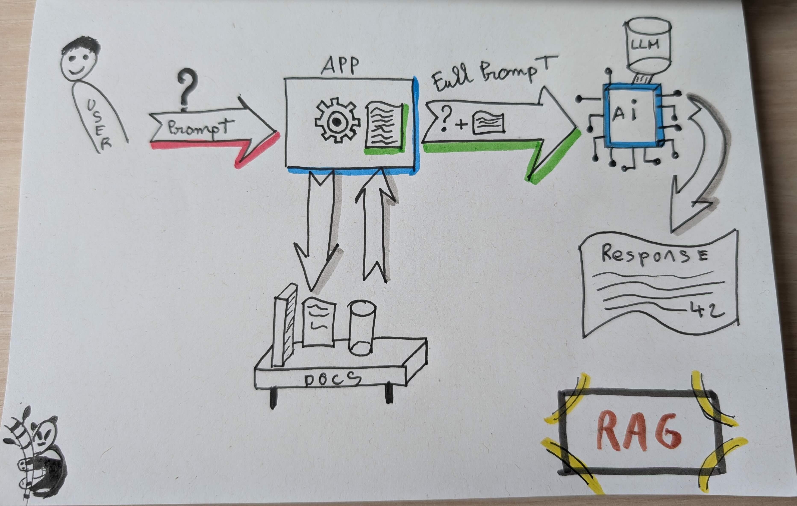

La génération de contenu assistée par l'intelligence artificielle (IA) a connu des avancées spectaculaires grâce aux
modèles de langage à grande échelle (LLMs). Cependant, ces modèles présentent des limites, notamment en termes de
précision et de pertinence des informations générées. Pour pallier ces défauts, la technique de **Retrieval-Augmented
Generation (RAG)** est devenue essentielle pour améliorer la génération de contenu en IA.

### Qu'est-ce que le RAG ?

Le **Retrieval-Augmented Generation (RAG)** est une architecture qui optimise les sorties des modèles de langage à
grande échelle en leur permettant d'accéder à des bases de connaissances externes et autorisées. Cette approche combine
les capacités des systèmes traditionnels de recherche d'informations avec celles des LLMs pour générer des réponses plus
précises et pertinentes.

### Comment fonctionne le RAG ?

Le processus de RAG se déroule en plusieurs étapes clés :

1. **Création de données externes** : Des données supplémentaires, souvent issues de bases de données de
   documents, sont préparées et converties en représentations vectorielles pour être accessibles aux LLMs.
2. **Recherche de pertinence** : Lorsqu'un utilisateur pose une question, le système effectue une recherche pour
   récupérer les informations les plus pertinentes à partir des données externes. Cela se fait en convertissant la
   requête utilisateur en une représentation vectorielle qui est ensuite comparée aux données stockées.
3. **Augmentation du prompt** : Les informations pertinentes récupérées sont ajoutées au prompt initial pour fournir au
   LLM un contexte plus riche et précis. Cela permet au modèle de générer des réponses plus exactes et mieux adaptées à
   la situation.
4. **Mise à jour des données externes** : Pour maintenir l'actualité des informations, les données externes sont
   régulièrement mises à jour, soit en temps réel, soit par traitement par lots périodiques.

### Avantages du RAG

Le RAG offre plusieurs avantages significatifs par rapport aux méthodes traditionnelles de génération de texte :

- **Précision et actualité** : En intégrant des données externes à jour, le RAG permet aux LLMs de fournir des réponses
  plus précises et plus pertinentes, même sur des sujets très spécifiques ou récents.
- **Contrôle et transparence** : Les organisations ont un meilleur contrôle sur les sources utilisées par les LLMs, ce
  qui améliore la transparence et la fiabilité des réponses générées.
- **Rentabilité** : Le RAG évite les coûts élevés associés à la ré-formation des modèles, car il n'est pas nécessaire de
  réentraîner les LLMs pour adapter leurs connaissances à des cas d'utilisation spécifiques.

